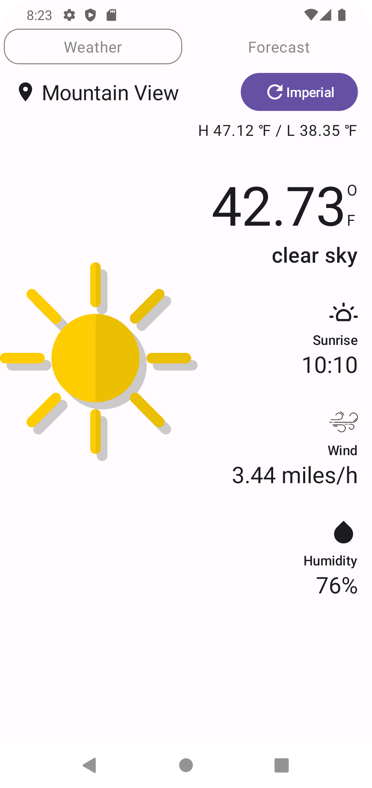
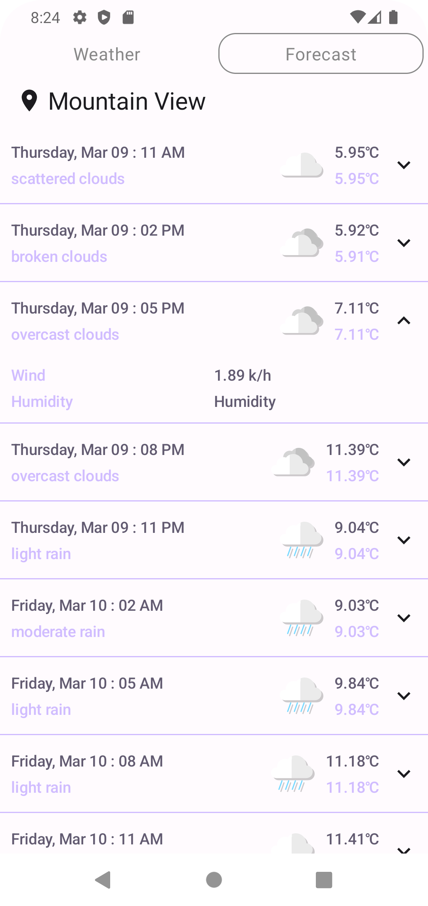
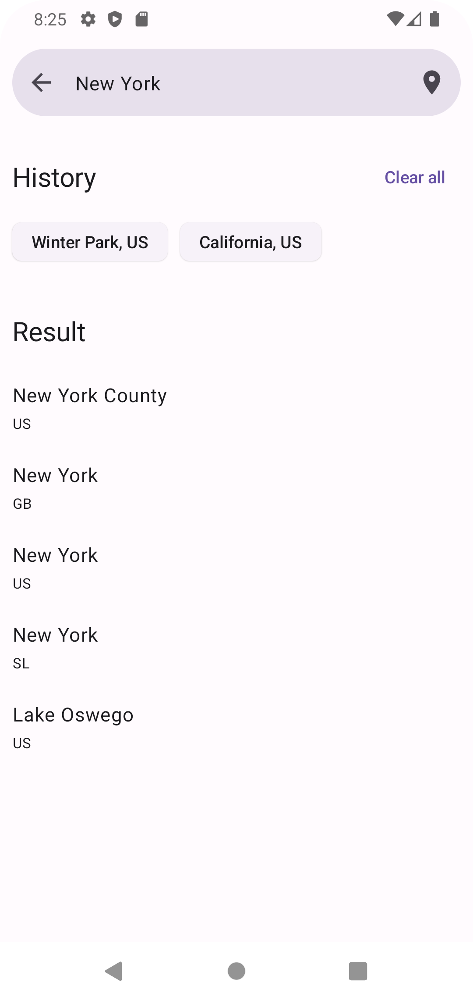

## Architecture
The Architecture Chosen for the app is MVI and SOLID principles are applied. an assessment by Ahmed Mourad

## Screenshots

<table align="center">
  <tr>
    <th>Dashboard (Dashboard)</th>
    <th>Forecast (Forecast)</th>
    <th>Search (Search)</th>
  </tr>
  <tr>
    <td align="center"></td>
    <td align="center"></td>
    <td align="center"></td>
  </tr>
</table>

## Libraries
1.  Jetpack Compose (UI)
2.  Dagger Hilt     (DI)
3.  Room     (DB)
4.  Kotlin Coroutines
5.  Retrofit2 (Network)

## Layers
The app is separated to 3 Layers

1. Data Layer
   1. Local Cache
   2. Remote API
2. Domain Layer
   1. Business Logic
   2. Repositories
3. Presentation Layer
   1. Composable Screens
   2. Composable Components
